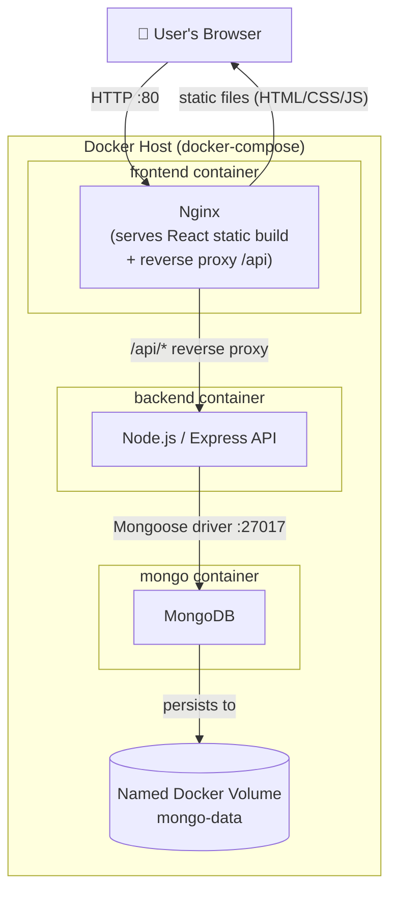

# Flipkart Clone (MERN) — Dockerized

This is a forked, a MERN (MongoDB, Express, React, Node.js) e-commerce clone. This fork adds **full Docker support**, turning the project into a set of containerized services that can be brought up with a single command, with persistent database storage and a production-style Nginx-served frontend.

## What's different in this fork

The original project ran the client and server as separate local Node processes. This fork containerizes the whole stack:

- **Backend Dockerfile** — builds the Node/Express API into its own image.
- **Frontend Dockerfile** — multi-stage build: compiles the React app into static files, then serves them via **Nginx** instead of the React dev server.
- **`nginx.conf`** — configured to serve the React static build and reverse-proxy `/api` requests to the backend container, which avoids the CORS errors you get when the frontend and backend run on different origins.
- **`docker-compose.yml`** — orchestrates all three services (client, server, MongoDB) on a shared Docker network.
- **Named Docker volume for MongoDB** — database files persist on the host, so data survives container restarts, crashes, or `docker rm`.

## Tech stack

| Layer      | Technology                          |
|------------|--------------------------------------|
| Frontend   | React (built as static files), served by Nginx |
| Backend    | Node.js + Express                   |
| Database   | MongoDB                             |
| Container  | Docker, Docker Compose              |
| Reverse proxy | Nginx (CORS handling + static file serving) |

## System design / architecture



**Request flow:**
1. The browser talks only to Nginx on port `80`.
2. Nginx serves the compiled React static files directly.
3. Any request to `/api/*` is reverse-proxied by Nginx to the backend Express container — this is what eliminates the CORS errors, since the browser only ever sees one origin.
4. The backend connects to MongoDB using the Docker Compose service name (e.g. `mongo:27017`) instead of `localhost`, since each service runs in its own container on the same Docker network.
5. MongoDB writes its data files to a **named volume**, which lives outside the container's writable layer — so `docker-compose down`, a crash, or `docker rm` on the mongo container does **not** delete your data.

## Project structure

```
flipkart-mern-project/
├── backend/
│   ├── Dockerfile
│   └── ...
├── frontend/
│   ├── Dockerfile
│   ├── nginx.conf
│   └── ...
├── docker-compose.yml
└── README.md
```
> Adjust the folder names above (`backend/`, `frontend/`) if your repo uses different ones (e.g. `client/`, `server/`).

## `docker-compose.yml` (overview)

```yaml
version: "3.8"

services:
  frontend:
    build: ./frontend
    ports:
      - "80:80"
    depends_on:
      - backend

  backend:
    build: ./backend
    ports:
      - "5000:5000"
    environment:
      - MONGO_URI=mongodb://mongo:27017/flipkart
    depends_on:
      - mongo

  mongo:
    image: mongo:latest
    ports:
      - "27017:27017"
    volumes:
      - mongo-data:/data/db

volumes:
  mongo-data:
```

The key part for data persistence is:
```yaml
volumes:
  - mongo-data:/data/db
```
This maps MongoDB's internal data directory (`/data/db`) to a Docker-managed named volume (`mongo-data`) that lives on the host filesystem, independent of the container's lifecycle.

## `nginx.conf` (overview)

Nginx is configured to:
- Serve the built React app (`index.html` + static assets) as the default site.
- Fall back to `index.html` for client-side routing (so React Router paths don't 404 on refresh).
- Reverse-proxy `/api/` requests to the backend container, so the browser never makes a cross-origin request.

```nginx
server {
    listen 80;

    root /usr/share/nginx/html;
    index index.html;

    location / {
        try_files $uri /index.html;
    }

    location /api/ {
        proxy_pass http://backend:5000/;
        proxy_set_header Host $host;
        proxy_set_header X-Real-IP $remote_addr;
    }
}
```

## Getting started

### Prerequisites
- [Docker](https://docs.docker.com/get-docker/)
- [Docker Compose](https://docs.docker.com/compose/install/) (bundled with Docker Desktop)

### Run the app
```bash
git clone https://github.com/<your-username>/flipkart-mern-project.git
cd flipkart-mern-project
docker-compose up --build
```

The app will be available at:
- Frontend: `http://localhost`
- Backend API: `http://localhost:5000` (proxied through Nginx at `/api`)
- MongoDB: `localhost:27017`

### Stop the app
```bash
docker-compose down
```
This stops and removes the containers **but keeps the `mongo-data` volume**, so your database is intact next time you run `docker-compose up`.

### Reset the database (if you ever need to)
```bash
docker-compose down -v
```
The `-v` flag removes volumes too — only use this if you actually want to wipe the database.

## Environment variables

| Variable      | Where       | Description                        |
|---------------|-------------|-------------------------------------|
| `MONGO_URI`   | backend     | MongoDB connection string (points to the `mongo` service) |
| `PORT`        | backend     | Port the Express server listens on |

Create a `.env` file for any secrets (API keys, JWT secrets, etc.) and reference it in `docker-compose.yml` via `env_file:` — don't commit real secrets to the repo.

